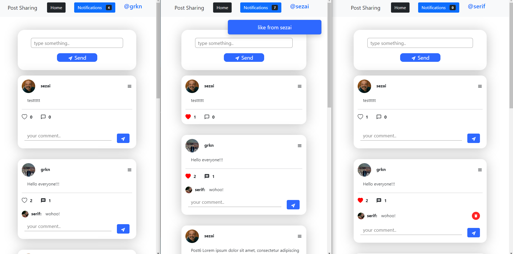

# Post Sharing with Push Notifs - Backend

### Used Technologies

**WebFlux:**

**MongoDB**

### How to run

#### clone the project: https://github.com/gurkanucar/post-sharing-be

```bash
  git clone https://github.com/gurkanucar/post-sharing-be
  cd post-sharing-be
```

#### create jar

```bash
  mvn clean install -DskipTests
```

#### build docker-compose

```bash
  docker-compose build --no-cache
```

#### run docker-compose

```bash
  docker-compose up --force-recreate
```

#### Postman Collection:

[https://github.com/gurkanucar/post-sharing-be/blob/master/post_share.postman_collection.json](https://github.com/gurkanucar/post-sharing-be/blob/master/post_share.postman_collection.json)

## Example Images



### Example Video:

[https://www.youtube.com/watch?v=mqDtfS2quto](https://www.youtube.com/watch?v=mqDtfS2quto)

### Frontend:

[https://github.com/gurkanucar/post-sharing-fe](https://github.com/gurkanucar/post-sharing-fe)
